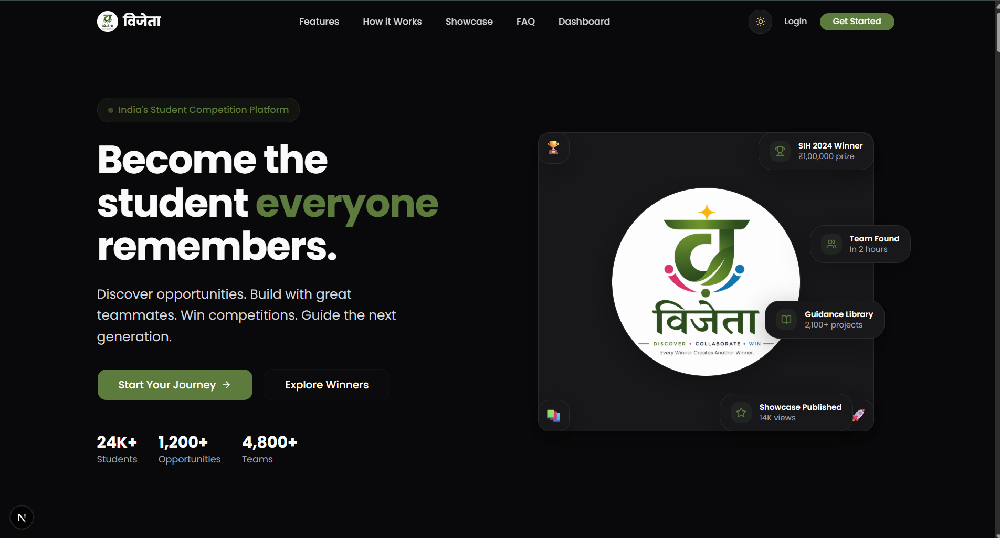

<p align="center">
  
</p>

<h1 align="center">"..विजेता.."</h1>
<h3 align="center">The Operating System for Ambitious Students</h3>

<p align="center">
  Discover opportunities. Build with great teammates. Win competitions. Guide the next generation.
</p>

<p align="center">
  <a href="#features">Features</a> •
  <a href="#tech-stack">Tech Stack</a> •
  <a href="#architecture">Architecture</a> •
  <a href="#getting-started">Getting Started</a> •
  <a href="#project-structure">Project Structure</a>
</p>

---

Every year, thousands of talented students never participate in scholarships, hackathons, and competitions not because they lack ability, but because they don't know where to start, can't find teammates, or lack proper guidance.

**Vijeta removes every barrier between "I want to participate" and "I became a winner."**

Winning should not be the end of the journey. Every winner creates resources that help produce the next generation of winners a self-sustaining ecosystem of excellence.

---

## 🎯 The Flywheel

```
Discover → Team Up → Learn → Build → Compete → Win → Publish → Mentor → Repeat
```

Vijeta is built around a virtuous cycle that takes a student from discovery all the way to becoming a mentor for the next cohort.

---

## ✨ Features

| Feature | Description |
|---|---|
| **🔍 Discover** | Browse hackathons, scholarships, competitions, fellowships, internships, and research opportunities with smart filters, search, and an interactive map |
| **👥 Team Up** | Find teammates by skills, location, and availability. Create or join open teams with defined roles |
| **🤖 AI Assistant (Margdarshak)** | Context-aware AI mentor powered by Gemini & OpenRouter. Get personalized guidance via slash commands like `/findhackathon`, `/mystats`, `/findteam` |
| **💬 Real-time Chat** | Direct messaging via Firebase Firestore for seamless team communication |
| **🏆 Showcase** | Publish winning projects with GitHub, demo, and PPT links. Inspire the next generation |
| **📊 Dashboard** | Personalized stats, upcoming deadlines, active teams, and AI-powered recommendations |
| **🔔 Activity Feed** | Track every interaction — bookmarks, team invites, friend requests, and more |
| **👤 Student Profiles** | Rich profiles with skills, badges, achievements, and availability status |

---

## ⚙️ Tech Stack

### 🖥️ Frontend


### ⚙️ Backend


### 🗄️ Database


### 🤖 AI Models


### 🎨 Diagram Engine


### 🛠️ Development


---

## 🏗️ Architecture

```
Browser
  │
  ├── Next.js App Router (Frontend)
  │     ├── (marketing)/   → Public pages (Landing, Showcase)
  │     ├── (app)/         → Authenticated pages (Dashboard, Discover, Teams, Chat)
  │     ├── api/           → REST API route handlers
  │     └── auth/          → Clerk sign-in / sign-up
  │
  ├── Backend (TypeScript, monolith within Next.js)
  │     ├── db/queries/    → Drizzle ORM query modules (11 modules)
  │     ├── ai/            → AI orchestration (Gemini + OpenRouter)
  │     └── services/      → Business logic (activity tracking, notifications)
  │
  ├── Database Layer
  │     ├── Neon PostgreSQL → Primary database (Drizzle ORM, 16 tables)
  │     └── Firebase Firestore → Real-time chat messaging
  │
  └── External Services
        ├── Clerk           → Authentication & user management
        ├── Google Gemini   → AI mentor mode
        ├── OpenRouter      → AI default mode / debate mode
        └── MapLibre GL     → Geographic opportunity map
```

---

## 🚀 Getting Started

### Prerequisites

- **Node.js** >= 18
- **PostgreSQL** (Neon account or local instance)
- **Firebase** project (for real-time chat)
- **Clerk** account (for authentication)

### Installation

```bash
# Clone the repository
git clone https://github.com/vedanttalekar/vijeta.git
cd vijeta

# Install dependencies
cd frontend
npm install

# Set up environment variables
cp .env.example .env.local
# Fill in your Clerk, Neon, Firebase, Gemini, and OpenRouter keys

# Push database schema
npm run db:push

# Seed the database (optional)
npm run db:seed

# Start development server
npm run dev
```

The app will be available at `http://localhost:3000`.

---

## 📁 Project Structure

```
vijeta/
├── frontend/
│   ├── app/
│   │   ├── (marketing)/     # Public landing pages
│   │   ├── (app)/           # Authenticated app pages
│   │   ├── api/             # REST API route handlers
│   │   └── layout.tsx       # Root layout
│   ├── backend/
│   │   ├── ai/              # AI integration (Gemini, OpenRouter)
│   │   ├── db/queries/      # Database query modules
│   │   └── services/        # Business logic services
│   ├── components/
│   │   ├── ui/              # shadcn/ui primitives
│   │   ├── layout/          # Navbar, Sidebar, Footer
│   │   ├── landing/         # Landing page sections
│   │   └── shared/          # Reusable components
│   ├── lib/                 # Utilities & Firebase client
│   ├── src/db/              # Drizzle schema & client
│   ├── public/              # Static assets
│   └── types/               # TypeScript type definitions
├── PRD.md                   # Product Requirements Document
├── DESGIN.md                # Design System
├── flow.md                  # Product Flows
└── tech.md                  # Technical Documentation
```

---

## 📚 Documentation

| Document | Description |
|---|---|
| [PRD.md](PRD.md) | Product requirements, vision, problem statement, and MVP scope |
| [DESGIN.md](DESGIN.md) | Complete design system — colors, typography, components, accessibility |
| [flow.md](flow.md) | All product flows — auth, discover, team formation, AI, showcase |
| [tech.md](tech.md) | Technical stack overview and architecture decisions |

---


<p align="center">
  <strong>Vijeta</strong> — विजेता (Victory)
</p>
